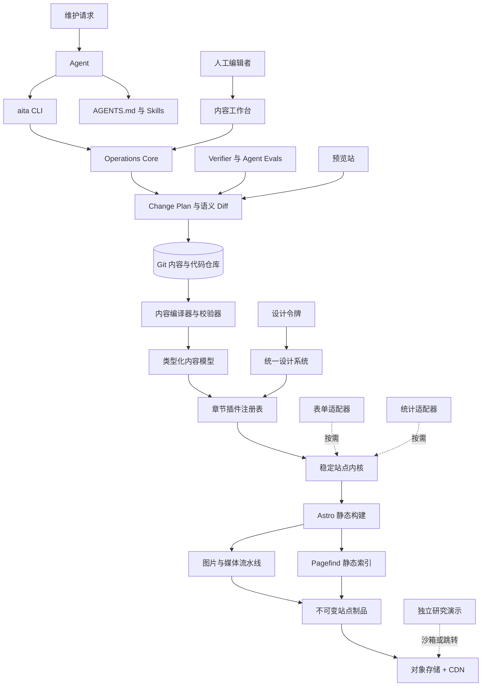
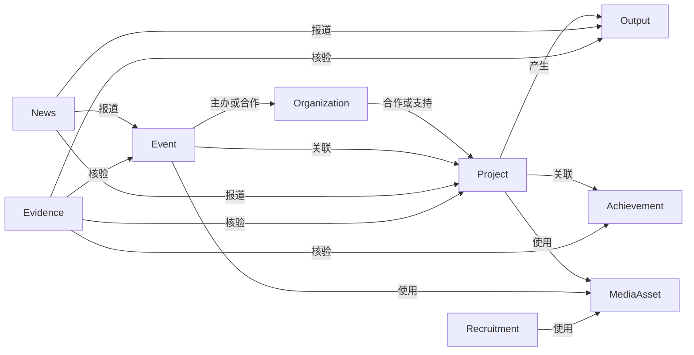
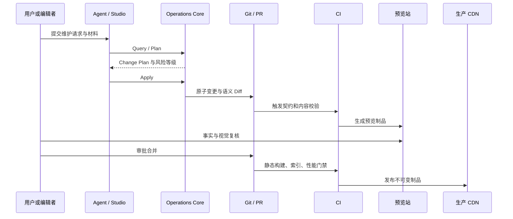

# AITA 官网技术架构设计 v2（Agent-Native）

## 0. 架构结论

AITA 官网采用 **Agent-Native 的可演进静态插件架构**：

- 以 **Astro + TypeScript** 作为当前公开站点宿主，默认生成静态 HTML；
- 以 **构建期章节插件** 组织首页、实验室介绍、科研项目、科研成果、荣誉、合作单位、活动与招新；
- 以 **结构化内容模型** 保存项目、机构、成果、奖项、活动、新闻、媒体和站点设置；
- 以 **统一设计系统** 约束所有章节的视觉、交互、响应式行为和可访问性；
- 以 **Agent Maintenance Plane** 提供可发现、类型化、可预演、可验证、可回滚的维护接口；
- 以 **适配器层** 隔离 CMS、搜索、媒体、表单、统计和部署平台；
- 普通章节由统一 CI 在构建期组装为静态发布物，高交互研究演示部署在独立故障域。

核心职责分离为：

> 内容模型拥有事实，章节插件拥有展示，设计系统拥有视觉语言，站点内核拥有路由与交付规则，Operations Core 拥有确定性维护能力，Agent 负责理解意图与编排操作。

本版本不建立独立的人员栏目、人员详情页或全局人员实体。项目、论文等内容确需展示姓名时，使用条目内部的轻量 `contributors` 展示字段，不形成可独立寻址的人员资料和跨栏目人物关系图。

---

## 1. 设计目标与范围

### 1.1 必须达到

1. 核心骨架在多年内保持稳定，章节可独立升级、替换或重写。
2. 普通内容页默认不向浏览器发送业务 JavaScript。
3. 项目、机构、成果、奖项、活动等事实只维护一份，各章节通过永久 ID 引用。
4. 章节技术栈变化不能破坏导航、SEO、视觉规范、内容 URL 和 Agent 维护协议。
5. 常见维护任务必须有机器可读的输入 Schema、确定性操作、语义 Diff 和验证结果。
6. Agent 无需遍历整个仓库或猜测目录结构，即可发现当前能力、约束和任务接口。
7. 内容编辑与代码开发解耦；Agent、开发者和内容编辑者共享同一套领域 Schema 与验证器。
8. 发布物是可回滚的不可变静态制品，可部署到任意对象存储和 CDN。
9. 中文为主，内容模型从第一天支持英文版本。
10. 所有结构性变更、依赖升级和生产发布均保留明确审批边界。

### 1.2 明确排除

1. 不把各章节部署成默认运行时微前端。
2. 不采用 Module Federation 组装普通介绍页面。
3. 不允许插件直接修改全局样式、全局状态或其他插件内部实现。
4. 不把 CMS 数据库设为不可迁移的唯一事实源。
5. 首版不同时实现多种 UI 框架适配器；首版仅实现 Astro renderer。
6. 不为静态介绍页引入长期运行的应用服务器。
7. 不让 Agent 直接以字符串方式修改任意 YAML、Markdown 或生成目录。
8. 不把自然语言 Prompt 当作数据完整性、安全或发布正确性的唯一保障。
9. 首版不实现多 Agent 编排、自治生产发布或通用工作流引擎。
10. 不建设独立的人员内容插件、人员内容集合或人员相关维护任务。

---

## 2. 总体架构



### 2.1 六个稳定边界

| 边界 | 长期稳定内容 | 可替换实现 |
|---|---|---|
| 内容边界 | 实体 ID、字段语义、关系、状态、证据和 URL | Markdown、YAML、CMS、数据库加载器 |
| 插件边界 | 插件清单、路由、导航贡献、首页插槽、性能预算 | Astro、未来静态 renderer、独立研究演示 |
| 视觉边界 | 设计令牌、语义组件、页面模式、可访问性规则 | CSS 实现、组件内部框架、组件文档工具 |
| 能力边界 | Search、Media、Form、Analytics 接口 | Pagefind、图片 CDN、Serverless、统计服务 |
| Agent 操作边界 | Operation ID、输入 Schema、Plan、Apply、Verify、错误码 | CLI、内容工作台、未来 MCP Adapter |
| 交付边界 | 静态制品、重定向清单、缓存规则、版本清单 | GitHub Pages、阿里云、Cloudflare、Vercel 等 |

### 2.2 Source of Truth

系统必须明确区分规范源与生成物：

```text
规范源
├─ content/                 公开内容事实
├─ plugins/                 章节页面与维护操作
├─ packages/design-system/  设计令牌与组件
├─ agent/                   Agent 协议、策略、Schema 与示例
└─ config/                  站点、路由、语言和部署配置

生成物
├─ dist/
├─ .astro/
├─ public/pagefind/
├─ public/generated-media/
└─ agent/generated/
```

Agent、编辑器和开发者不得直接修改生成物。

---

## 3. 稳定站点内核

`@aita/kernel` 仅负责全站基础能力：

- 根布局、页头、页脚与跳转到正文；
- 插件注册、协议兼容性和依赖边界检查；
- 路由装配、冲突检测、永久 URL 和重定向；
- 中英文 URL 与语言切换；
- SEO、Open Graph、JSON-LD、站点地图和 canonical；
- 全局 CSP、缓存元数据、404 与错误页；
- 首页和页脚的有限插槽；
- 构建日志、插件性能预算和发布清单；
- Agent 操作产生的变更元数据和内容版本标识。

内核不得包含具体项目、成果、奖项或活动页面。首页作为 `home` 插件存在，内核仅提供布局与插槽协议。

### 3.1 内核升级策略

- 锁定受支持的 Astro 主版本，不在生产环境自动追随 `latest`；
- `@aita/plugin-sdk` 包装 Astro 路由注入、内容查询和构建钩子；
- 插件不能直接依赖 Astro Integration 的内部行为；
- 内核、章节协议、Agent 操作协议和内容 Schema 分别版本化；
- 主版本升级先在预览分支运行契约、视觉、可访问性、性能和 Agent Recipe 测试；
- 同一章节允许保留旧实现与新实现，通过注册表切换并快速回滚。

---

## 4. 章节插件架构

### 4.1 首批章节插件

```text
home          首页编排与精选内容
about         实验室介绍、愿景与研究方向
research      对外合作、科研和工程项目
outputs       论文、专利、软件著作权与开源成果
achievements  竞赛、奖项与创新项目
partners      合作单位
activities    新闻、学术交流和活动图库
join          招新、联系方式与常见问题
```

### 4.2 插件清单

```ts
export default defineChapter({
  apiVersion: "aita.chapter/v1",
  id: "research",
  version: "1.0.0",
  routeBase: "/research",
  renderer: "astro",

  routes: [
    route("/", "./pages/index.astro"),
    route("/[slug]", "./pages/detail.astro"),
  ],

  navigation: {
    label: { zh: "科研项目", en: "Research" },
    order: 30,
  },

  consumes: ["projects", "organizations", "outputs", "mediaAssets"],
  contributes: {
    home: ["./blocks/FeaturedProjects.astro"],
    footer: [],
  },

  operations: [
    "research.add-project",
    "research.update-project",
    "research.archive-project",
  ],

  capabilities: ["search", "responsive-images"],
  performance: {
    contentPageInitialJsKb: 0,
    interactiveRouteJsKb: 80,
  },
});
```

### 4.3 强制隔离规则

1. 插件只能依赖 `plugin-sdk`、领域模型、设计系统、Operations SDK 和公开能力适配器。
2. 插件之间禁止直接 import；跨章节关系通过实体 ID 与公共 URL 解析器完成。
3. 插件不得修改 `html`、`body`、全局导航、全局字体和全局设计令牌。
4. 插件 CSS 必须进入指定 cascade layer，并以插件根节点为作用域。
5. 插件不得在每个页面注入全局脚本。
6. 插件声明所需外部源，内核统一生成 CSP；未声明的远程资源导致构建失败。
7. 路由冲突、重复导航 ID、越界依赖和性能超限全部阻断合并。
8. 插件不得绕过 Operations Core 自行实现同类内容写入逻辑。
9. 插件的 Operation ID 一旦发布不得静默改变语义；破坏性变更必须升级版本并提供迁移器。

### 4.4 三种运行模式

| 模式 | 使用范围 | 技术形态 | 默认策略 |
|---|---|---|---|
| Static Chapter | 介绍、项目、成果、活动、合作单位 | Astro / 静态 HTML | 全站默认 |
| Interactive Island | 搜索、筛选、时间轴、可视化 | Vanilla、Custom Element、React、Svelte 等局部岛 | 明确需要时启用 |
| Remote Lab | 在线模型、GPU 推理、复杂研究工具 | 独立应用、独立域名、沙箱 iframe 或链接 | 与主站故障域隔离 |

首版仅实现 `renderer: "astro"`。协议保留 `renderer: "static-artifact"` 扩展位，用于未来将其他静态生成技术编译为标准化页面制品；在出现真实迁移需求前不实现该适配器。

高交互研究演示使用独立部署：

```text
www.aita.example       官方介绍站
demo.aita.example      在线研究演示
studio.aita.example    内容工作台
```

---

## 5. 内容领域模型

官网内容从长篇自由文本迁移为受 Schema 约束的结构化实体。

### 5.1 核心实体

```text
Organization
Project
Output        = Paper | Patent | SoftwareCopyright | OpenSource
Achievement   = Award | Competition | Grant
Event
News
Recruitment
MediaAsset
ExternalLink
SiteSetting
Redirect
Evidence
```

### 5.2 关系模型



### 5.3 局部贡献者字段

论文作者、项目参与者或奖项相关人员如需展示，使用所属实体内部的值对象，不建立全局资料：

```yaml
contributors:
  - displayName: "示例姓名"
    role: "author"
    order: 1
    externalUrl: null
```

约束如下：

- `contributors` 仅承担当前条目的展示；
- 不生成个人 URL、个人详情页或全站反向关系；
- 不保存非公开联系方式、教育经历或其他扩展个人资料；
- 同名不自动合并，Agent 不得根据姓名推断身份；
- 作者顺序、角色等事实仍需 Evidence 支持。

### 5.4 永久数据规则

- 所有顶层实体使用永久 ID；标题和 slug 变化不得改变 ID；
- slug 变化自动生成旧 URL 重定向；
- 跨实体关系存 ID，不复制机构、项目或成果标题；
- `status` 使用受控枚举，明确区分草稿、进行中、已交付、预印本、已录用、已发表、已授权和归档；
- 论文、专利、奖项、合作、活动日期等重要事实包含 `evidenceRefs`、`verifiedAt` 和 `maintainer`；
- 中英文内容通过 `translationOf` 或同一实体的 locale 字段关联；
- 图片必须包含替代文本、说明、版权来源、焦点区域、宽高和内容哈希；
- 删除公开内容默认进入 `archived` 或 tombstone 状态，永久 ID 与历史 URL 保留。

### 5.5 项目示例

```yaml
id: project:sightpro
slug: sightpro
title:
  zh: SIGHTpro——基于视觉语言模型的青光眼诊疗系统
  en: SIGHTpro
status: active
organizationIds:
  - org:example-lab
outputIds: []
contributors:
  - displayName: "示例姓名"
    role: "project-lead"
    order: 1
featured: true
evidenceRefs:
  - evidence:project-sightpro-introduction
verifiedAt: 2026-09-01
```

### 5.6 内容存储

```text
content/
├─ organizations/*.yaml
├─ projects/*/index.md
├─ outputs/*.yaml
├─ achievements/*.yaml
├─ events/*/index.md
├─ news/*/index.md
├─ recruitment/*.yaml
├─ evidence/*.yaml
├─ redirects/*.yaml
└─ settings/*.yaml
```

结构化字段使用 YAML/JSON，长篇介绍使用受限 Markdown。内容层禁止执行任意 React、Vue、Svelte 或 MDX 代码。Astro Content Layer 与 Zod 负责类型检查、引用完整性和构建期查询。Git 历史是审计与回滚来源，CMS 仅是编辑界面。

---

## 6. 统一设计系统

### 6.1 分层

```text
@aita/tokens       原始与语义设计令牌
@aita/foundations  Reset、字体、网格、动效、排版和 CSS layers
@aita/ui           Button、Link、Card、Section、Grid、Dialog 等基础组件
@aita/patterns     ProjectCard、Publication、Timeline、LogoWall、Gallery 等领域模式
@aita/icons        统一 SVG 图标
@aita/ui-react     出现真实 React 需求后建立的薄适配层
```

### 6.2 视觉契约

- 令牌采用 DTCG 兼容格式保存，构建为 CSS Custom Properties 和 TypeScript 类型；
- 令牌分为 primitive、semantic、component 三层；业务插件只能直接使用 semantic/component token；
- 字体、色彩、间距、圆角、阴影、动效时长、断点和容器宽度均进入令牌；
- 组件通过 props 和 slots 暴露语义，不向插件公开内部 class 名；
- 跨框架复用优先共享令牌、语义 HTML 和可访问性规则；
- 仅对确需跨框架复用的交互原语提供 Custom Element；
- Tailwind 类名或某一 UI 框架 API 不作为全站长期协议。

### 6.3 领域组件

首批领域组件包括：

```text
ProjectCard
ProjectHero
PublicationCitation
OutputStatusBadge
AchievementTimeline
PartnerLogoWall
ActivityGallery
NewsCard
RecruitmentCTA
EvidenceBadge
ExternalLinkCard
```

同类信息必须复用领域组件，插件不得各自重新设计项目卡片、论文引用、奖项时间轴和合作单位展示。

### 6.4 组件注册表

为 Agent 提供机器可读的 `component-registry.json`：

```json
{
  "ProjectCard": {
    "purpose": "展示科研或工程项目摘要",
    "propsSchema": "agent/schemas/ui/project-card.schema.json",
    "allowedVariants": ["default", "featured", "compact"],
    "allowedContexts": ["home", "research", "search"],
    "clientJavaScriptKb": 0,
    "accessibilityRules": [
      "标题必须使用语义标题元素",
      "封面图片必须包含替代文本"
    ]
  }
}
```

CLI 提供：

```bash
aita ui list --json
aita ui inspect ProjectCard --json
aita ui validate --changed --json
```

### 6.5 组件治理

- `apps/design-docs` 渲染真实组件、状态矩阵和页面模式；
- Playwright 对关键视口进行视觉回归；
- 每个交互组件必须覆盖键盘、焦点、无障碍名称和 reduced-motion 状态；
- 新增领域组件前必须证明现有组件无法表达需求；
- Agent 不能通过局部 CSS 绕过设计令牌和组件注册表。

---

## 7. Agent-Native 维护平面

### 7.1 定义

Agent-Native 不等于在仓库中加入一份长 Prompt。其工程定义是：

> 每一种高频维护行为均具有可发现的任务 ID、机器可读的输入 Schema、可预演的 Change Plan、原子且幂等的执行、稳定的错误码、语义 Diff、自动验证和可回滚记录。

Agent 负责：

- 理解自然语言维护请求；
- 收集已有材料中的事实和证据；
- 选择合适的 Operation；
- 填充结构化输入；
- 检查 Plan、Diff 和验证结果；
- 在允许范围内修复失败；
- 形成最终变更报告。

确定性工具负责：

- 定位规范源；
- 校验 Schema；
- 解析 ID 和引用；
- 生成 Change Plan；
- 原子写入；
- 构建、测试、预览和回滚；
- 阻止越权、过期或冲突操作。

### 7.2 Operations Core

建立独立包：

```text
packages/
├─ operations-core/
├─ cli/
├─ verification/
└─ mcp-adapter/       # 后续按需实现
```

`operations-core` 暴露四个稳定原语：

```ts
query(input): QueryResult
plan(operationId, input, context): ChangePlan
apply(plan, context): ApplyResult
verify(scope, context): VerificationResult
```

CLI、内容工作台和未来 MCP Adapter 全部调用这套实现，不重复业务逻辑。

### 7.3 Operation 定义

每个章节插件声明自己支持的维护操作：

```ts
export const addProject = defineOperation({
  id: "research.add-project",
  version: 1,

  input: z.object({
    id: ProjectIdSchema,
    slug: SlugSchema,
    title: LocalizedTextSchema,
    status: ProjectStatusSchema,
    organizationIds: z.array(OrganizationIdSchema),
    contributors: z.array(ContributorLabelSchema).default([]),
    evidenceRefs: z.array(EvidenceIdSchema).min(1),
  }),

  risk: "reviewed-content",

  plan(context, input) {
    // 计算实体、关系、路由、搜索索引和首页模块变化
  },

  apply(context, plan) {
    // 使用临时文件与原子 rename 完成写入
  },

  verify(context, result) {
    // 校验 Schema、引用、URL、证据、构建和搜索记录
  },
});
```

Operation 必须满足：

- 输入和输出均可生成 JSON Schema；
- `plan()` 不修改仓库；
- `apply()` 使用 `baseRevision` 防止覆盖并发修改；
- 重复执行同一 Plan 不产生重复实体；
- 所有外部副作用显式声明；
- 写入范围超出 Plan 时立即失败；
- 验证项由 Operation 与全局策略共同决定。

### 7.4 首批标准任务

```text
home.feature-content
about.update-overview
about.update-direction
research.add-project
research.update-project
research.archive-project
outputs.add-output
outputs.update-output
outputs.change-status
achievements.add-record
achievements.update-record
partners.upsert-organization
activities.publish-event
activities.update-event
activities.publish-news
join.update-recruitment
media.import
media.replace
media.update-metadata
site.update-setting
redirect.add
```

不为每一个字段创建独立任务。细粒度更新通过领域任务的 typed patch 完成，并由字段级策略决定风险。

### 7.5 `aita` CLI

CLI 是 Agent、开发者和 CI 的共同入口：

```bash
aita describe --json
aita task list --json
aita task schema research.add-project --json
aita query entity project:sightpro --json
aita task plan research.add-project --input request.yaml --output .aita/plans/add-project.json --json
aita task apply .aita/plans/add-project.json --json
aita diff --semantic --changed --json
aita verify --changed --json
aita preview create --changed --json
aita rollback inspect <release-id> --json
```

每个命令必须支持：

- `--json`；
- `--non-interactive`；
- 变更命令的 `--dry-run`；
- 稳定退出码与错误码；
- stdout 输出结果、stderr 输出诊断；
- 无隐藏式确认和隐藏式网络请求；
- `--base-revision` 或 Plan 内置基线；
- 明确的 `nextActions`；
- 相同输入的可重复结果。

CLI 本身不调用 LLM。Agent 负责推理，CLI 负责确定性执行。

### 7.6 Change Plan

所有写入先生成计划：

```json
{
  "schemaVersion": "aita.change-plan/v1",
  "operation": "outputs.change-status",
  "operationVersion": 1,
  "baseRevision": "9e4a2c1",
  "risk": "reviewed-content",
  "preconditions": [
    "output entity exists",
    "target status transition is legal",
    "publication evidence is present"
  ],
  "changes": [
    {
      "type": "update-entity",
      "entityId": "output:example-2026",
      "fields": ["status", "evidenceRefs", "verifiedAt"]
    }
  ],
  "affectedRoutes": ["/outputs/example-2026"],
  "requiredChecks": [
    "content-schema",
    "entity-relations",
    "evidence",
    "routes",
    "search-index"
  ]
}
```

`apply` 前必须验证：

- Git 基线未变化；
- Operation 和内容 Schema 版本仍兼容；
- 目标实体状态符合前置条件；
- Plan 未过期、未执行或未被篡改；
- 所有写入路径位于允许范围；
- 必需证据仍可定位。

### 7.7 语义 Diff

普通 Git Diff 保留，但 Agent 和审核者优先查看语义 Diff：

```text
实体变更
  output:example-2026
    status: preprint → accepted
    evidenceRefs: +1
    verifiedAt: 2026-09-01

关系变更
  project:example-project → output:example-2026

页面变更
  /outputs/example-2026
  /research/example-project

索引变更
  output:example-2026 已重新索引

策略结果
  事实证据：通过
  永久 URL：未变化
  设计系统：无变化
```

语义 Diff 必须能够识别：

- 实体创建、更新、归档和恢复；
- 状态迁移；
- 关系增删；
- 路由、重定向和导航变化；
- 首页精选变化；
- 设计令牌和组件使用变化；
- 搜索索引、媒体引用和 SEO 元数据变化；
- 风险等级与所需审批。

### 7.8 Verifier

`aita verify` 按变更范围运行最小充分检查：

```text
内容校验
├─ JSON/Zod Schema
├─ 永久 ID 与 slug
├─ 引用完整性
├─ 状态迁移
├─ Evidence
└─ 多语言一致性

页面校验
├─ 路由与重定向
├─ 构建
├─ 内部链接
├─ SEO 元数据
├─ 搜索记录
└─ 图片元数据

界面校验
├─ 组件注册表
├─ 设计令牌
├─ 可访问性
├─ 视觉回归
└─ 性能预算

工程校验
├─ TypeScript
├─ 依赖边界
├─ Operation 契约
├─ Recipe 测试
└─ 生成物漂移
```

错误使用稳定结构：

```json
{
  "ok": false,
  "errors": [
    {
      "code": "AITA_CONTENT_EVIDENCE_REQUIRED",
      "entityId": "output:example-2026",
      "field": "status",
      "message": "已录用状态缺少可验证来源",
      "suggestedAction": "provide-evidence"
    }
  ],
  "nextActions": [
    "补充官方录用页面或录用通知的 evidence 引用",
    "重新生成 Change Plan"
  ]
}
```

Agent 根据错误码执行修复，不能依赖脆弱的自然语言终端解析。

---

## 8. Agent 指令、Skills 与 Cookbook

### 8.1 职责划分

```text
AGENTS.md   定义始终必须遵守的约束与完成规则
Skill       定义某一类维护任务的按需工作流
Schema      定义合法输入、数据和操作结果
CLI         执行确定性查询、计划、写入和验证
Cookbook    提供经过测试的真实实例与边界情况
Verifier    判断变更是否真正完成
MCP         后续在远程接入场景中提供传输层
```

### 8.2 根目录 `AGENTS.md`

根文件保持短小，只包含全局不变量：

```md
# AITA 官网维护规则

## 规范源
- 内容事实以 `content/` 为准。
- 页面、搜索索引和优化媒体属于生成物，禁止直接修改。
- 组件规范以 `agent/component-registry.json` 为准。
- 插件边界以 `chapter.manifest.ts` 为准。

## 必经流程
1. 运行 `aita describe --json`。
2. 对标准任务读取 Operation Schema。
3. 先生成 Change Plan，再执行 Apply。
4. 检查语义 Diff。
5. 完成前运行 `aita verify --changed --json`。
6. 页面或样式变化必须生成预览并进行视觉检查。

## 事实约束
- 禁止推断缺失的机构、作者顺序、成果状态、日期和奖项级别。
- 重要公开事实必须包含 Evidence。
- 缺失事实保持为空，不得使用合理猜测补齐。

## 视觉约束
- 插件仅使用语义设计令牌和已注册组件。
- 禁止在插件中直接写品牌颜色、全局字体或全局间距。
- 修改设计系统必须运行视觉、可访问性和性能检查。

## 范围控制
- 禁止修改与任务无关的插件。
- 禁止自行增加生产依赖。
- 禁止为普通内容更新重构架构。
- 禁止绕过 CLI 直接执行已有标准任务。

## 完成条件
- 用户要求完整反映在语义 Diff 中。
- 必需验证全部通过。
- 没有未解释的生成文件变化。
- 最终报告包含实体、页面、证据、检查结果和残余风险。
```

各插件可放置局部 `AGENTS.md`，只补充本章节领域规则和验证要求，不复制根规则。

### 8.3 Skills

首版建立五个按需 Skill：

```text
.agents/skills/
├─ aita-content-maintenance/
├─ aita-media-management/
├─ aita-plugin-development/
├─ aita-design-system/
└─ aita-release/
```

Skill 保持短小。大量领域说明、失败案例和政策拆入 `references/`，输入模板放入 `templates/`。

内容维护 Skill 的标准流程：

1. 运行 `aita describe --json`；
2. 用 `aita task list` 定位 Operation；
3. 读取 Operation Schema；
4. 从用户材料提取事实与 Evidence；
5. 不推断缺失事实；
6. 生成 Change Plan；
7. 检查风险、影响范围和语义 Diff；
8. 应用计划；
9. 运行 changed-scope 验证；
10. 报告实体、路由、证据、检查结果和残余风险。

### 8.4 可执行 Cookbook

Cookbook 不是静态教程，而是可执行测试夹具：

```text
agent/recipes/
├─ add-project/
│  ├─ request.yaml
│  ├─ expected-plan.json
│  ├─ assertions.yaml
│  └─ explanation.md
├─ add-publication/
├─ change-publication-status/
├─ publish-activity-gallery/
├─ replace-project-cover/
├─ update-recruitment/
└─ upgrade-chapter-plugin/
```

示例断言：

```yaml
must:
  - create_entity: project:example-project
  - include_evidence: true
  - preserve_unrelated_routes: true
  - pass_check: content-schema
  - pass_check: performance-budget

must_not:
  - modify_plugin: outputs
  - add_production_dependency: true
  - write_generated_directory: true
```

CI 执行：

```bash
aita recipe test
```

这些 Recipe 同时承担：

- CLI 使用示例；
- Operation 回归测试；
- Agent Evals；
- Skills 调优依据；
- 新工程师培训材料。

### 8.5 机器可读仓库地图

```text
agent/
├─ manifest.json
├─ policies.yaml
├─ task-registry.json
├─ component-registry.json
├─ schemas/
├─ recipes/
├─ evals/
└─ generated/
```

`manifest.json` 至少包含：

- Agent 协议版本；
- 内容 Schema 版本；
- 插件清单；
- 规范源和生成目录；
- CLI 入口；
- 必经检查；
- 支持的语言；
- 架构文档位置；
- 当前 Git revision。

`task-registry.json` 由插件 Operation 定义自动生成，禁止手工维护重复数据。

### 8.6 Agent Evals

至少建立以下评测：

- 给定材料新增项目，事实不应被补写；
- 更新成果状态时必须要求 Evidence；
- 相似标题不能导致重复实体；
- 修改活动页面不能影响无关章节；
- 替换图片后应保留逻辑资产 ID；
- 修改组件时必须触发视觉与可访问性检查；
- 并发变更后旧 Plan 必须因 `baseRevision` 不匹配而失败；
- Agent 不得写入生成目录或直接修改发布制品；
- Agent 不得为内容更新新增生产依赖；
- 发布命令不得绕过审批策略。

Evals 使用不同 Agent 和不同模型定期执行，报告任务成功率、无关变更率、事实幻觉率、修复轮次和 Token 消耗。

---

## 9. 权限、风险与审批

`agent/policies.yaml` 定义风险等级：

```yaml
riskLevels:
  routine-content:
    examples:
      - correct-typo
      - update-project-description
      - replace-verified-image
    action: create-pr
    autoMerge: conditional

  reviewed-content:
    examples:
      - add-publication
      - change-publication-status
      - publish-partnership
      - add-award
      - change-permanent-route
    action: require-human-review

  structural:
    examples:
      - modify-design-system
      - upgrade-plugin-framework
      - add-production-dependency
      - change-content-schema
      - change-operation-contract
    action: require-code-review

  privileged:
    examples:
      - production-release
      - delete-public-content
      - modify-domain-or-dns
      - modify-secrets
      - change-security-policy
    action: explicit-approval
```

执行规则：

- Agent 可自动生成 PR、预览和检查结果；
- `routine-content` 在全部检查通过且策略允许时可自动合并；
- 公开成果状态、合作关系、永久 URL 等事实性变更必须人工复核；
- 结构变更必须代码审查；
- 生产发布、域名、密钥和安全策略要求显式审批；
- 删除采用 `active → archived → tombstone`，不直接物理删除永久实体。

---

## 10. 内容工作台与发布流程

### 10.1 编辑端

建立独立 `apps/studio`，首版采用 Keystatic 或等价的 Git-backed 编辑界面：

- 人工编辑者通过表单维护 Markdown、YAML 和 JSON；
- 所有写入调用 Operations Core，不建立第二套校验逻辑；
- 管理端与公开站点分离，不向公开站点增加运行时依赖；
- CMS Schema 与领域模型共享；
- 将来更换 CMS 时，仅替换 UI 与 Content Source Adapter；
- Agent 可以直接使用 CLI，不需要模拟点击后台页面。

### 10.2 发布链路



外部链接在线状态检查放入定时审计任务，不阻断每次正常发布；内容事实是否具备 Evidence 则属于强阻断项。

### 10.3 发布与回滚

每个生产制品包含：

```text
release-id
Git SHA
content schema version
chapter protocol version
agent operation protocol version
plugin versions
content digest
redirect manifest
asset manifest
verification report
```

回滚以完整不可变制品为单位，禁止在 CDN 上手工覆盖单个文件。

---

## 11. 性能架构

### 11.1 基本策略

1. 普通页面预渲染为静态 HTML，默认零业务 JavaScript。
2. 搜索、筛选和图库脚本在用户打开或组件进入视口后加载。
3. 不启用全站 SPA 路由；跨文档动画仅作渐进增强。
4. 图片构建时生成 AVIF/WebP 与响应式尺寸，始终输出宽高。
5. 正文采用系统中文字体栈；品牌展示字体仅保留必要字符子集。
6. 第三方视频和地图使用 facade，点击后加载 iframe。
7. 搜索采用 Pagefind Extended；搜索代码不进入首屏包。
8. 静态资产使用内容哈希和长期 immutable 缓存；HTML 使用短 TTL 与 `stale-while-revalidate`。
9. Agent Maintenance Plane、CLI、CMS 和验证逻辑不进入公开站点浏览器包。
10. 远程研究演示独立部署，故障和依赖不传播到主站。

### 11.2 强制预算

| 指标 | 门禁 |
|---|---:|
| 普通内容页首屏业务 JS | 0 KB |
| 全站基础 JS，不含统计 | ≤ 10 KB gzip |
| 有复杂交互的单页初始 JS | ≤ 80 KB gzip |
| 全局 CSS | ≤ 35 KB gzip |
| 单插件新增 CSS | ≤ 10 KB gzip |
| 移动端 LCP 图片 | ≤ 200 KB，特殊页面需审批 |
| LCP p75 | ≤ 2.5 s |
| INP p75 | ≤ 200 ms |
| CLS p75 | ≤ 0.1 |

真实生产 RUM 是最终依据，Lighthouse 用于合并前诊断。性能超限必须在 Change Plan 和语义 Diff 中显式显示。

---

## 12. 搜索、媒体、表单与动态能力

### 12.1 搜索适配器

```ts
interface SearchRecord {
  id: string;
  locale: "zh" | "en";
  type:
    | "organization"
    | "project"
    | "output"
    | "achievement"
    | "event"
    | "news"
    | "recruitment";
  title: string;
  text: string;
  url: string;
  filters: Record<string, string | string[]>;
}
```

首版实现 `PagefindAdapter`。未来切换 Typesense、Meilisearch 或其他服务时，章节插件与内容实体不变化。

### 12.2 媒体适配器

首版本地图片由 Astro 构建优化。内容条目保存逻辑资产 ID：

```yaml
coverAssetId: media:project-sightpro-cover
```

`MediaAdapter` 决定文件路径、图片 CDN URL 和变体。替换图片不改变逻辑 ID，从而避免正文和插件大范围修改。

### 12.3 表单适配器

招新和联系表单作为独立 Serverless 能力：

- 同源 API 或独立 API 子域；
- 输入 Schema、速率限制、蜜罐和验证码按风险启用；
- 主站构建不依赖表单后端；
- 表单故障不能影响介绍页面访问；
- CLI 和 Agent 不读取表单中的敏感提交内容，除非存在单独授权的受控操作。

### 12.4 研究演示

在线模型、GPU 推理或复杂实验工具部署到独立应用：

- 独立依赖和发布流程；
- 独立 CSP、权限和监控；
- 通过沙箱 iframe 或显式外链接入主站；
- 主站仅保存演示元数据、封面、状态和目标 URL；
- 演示故障时主站展示降级说明，不影响其他页面。

---

## 13. 安全与隐私

- 主站静态化，浏览器中不保存密钥；
- CSP 默认 `self`，插件按清单申请额外来源；
- 远程研究演示部署在独立源，iframe 使用最小 `sandbox` 与 `allow`；
- 内容渲染白名单化，禁止未经审查的任意 HTML 和脚本；
- 上传图片移除不必要 EXIF，并记录版权与使用授权；
- 姓名如出现在论文、项目或活动条目中，仅保留公开展示所需文本；
- 不在内容仓库保存私人邮箱、手机号、地址或未公开申请信息；
- 招新与联系表单数据进入独立受控存储，不进入静态内容仓库；
- Agent 只能访问当前任务授权的文件、工具和外部服务；
- Plan 绑定 Git revision、Operation version 和内容 Schema version；
- 依赖锁文件、自动漏洞扫描和可复现构建；
- 发布制品包含完整版本清单，可快速回滚；
- CLI 日志不得输出密钥、令牌或表单敏感数据。

---

## 14. SEO、国际化与可访问性

- 中文作为默认语言使用根路径 `/...`，英文使用 `/en/...`；
- Project、Organization、ScholarlyArticle、Event 等页面输出适当 JSON-LD；
- 论文页面生成 BibTeX、DOI 链接和规范引用文本；
- 所有列表均输出可抓取的服务端 HTML；
- 图片、图表和活动照片包含替代文本或装饰标记；
- 目标为 WCAG 2.2 AA；
- 动画遵循 `prefers-reduced-motion`；
- 键盘操作、焦点可见、跳转正文、语义标题层级和语言属性进入组件契约；
- Agent 新增内容时必须校验标题层级、alt 文本、链接名称和语言字段；
- 多语言缺失时允许明确回退，但不得把机器生成翻译静默标记为人工审核版本。

---

## 15. 仓库结构

```text
aita-web/
├─ AGENTS.md
├─ .agents/
│  └─ skills/
│     ├─ aita-content-maintenance/
│     ├─ aita-media-management/
│     ├─ aita-plugin-development/
│     ├─ aita-design-system/
│     └─ aita-release/
├─ agent/
│  ├─ manifest.json
│  ├─ policies.yaml
│  ├─ task-registry.json
│  ├─ component-registry.json
│  ├─ schemas/
│  ├─ recipes/
│  ├─ evals/
│  └─ generated/
├─ apps/
│  ├─ site/                    # 公开站点宿主
│  ├─ studio/                  # 内容工作台
│  └─ design-docs/             # 组件与页面模式文档
├─ packages/
│  ├─ kernel/
│  ├─ plugin-sdk/
│  ├─ operations-core/
│  ├─ cli/
│  ├─ verification/
│  ├─ domain/
│  ├─ content-loader-git/
│  ├─ design-system/
│  │  ├─ tokens/
│  │  ├─ foundations/
│  │  ├─ ui/
│  │  ├─ patterns/
│  │  └─ icons/
│  ├─ search-pagefind/
│  ├─ media-local/
│  ├─ deployment-static/
│  └─ mcp-adapter/             # 首版不启用
├─ plugins/
│  ├─ home/
│  ├─ about/
│  ├─ research/
│  ├─ outputs/
│  ├─ achievements/
│  ├─ partners/
│  ├─ activities/
│  └─ join/
├─ content/
│  ├─ zh/
│  └─ en/
├─ tooling/
│  ├─ content-lint/
│  ├─ plugin-contract/
│  ├─ link-audit/
│  ├─ operation-contract/
│  └─ performance-budget/
├─ config/
├─ pnpm-workspace.yaml
└─ .changeset/
```

首版保持单一 monorepo。仅在权限、团队边界或发布频率出现真实冲突后，才拆分内容仓库、研究演示或单独章节。

---

## 16. CI 质量门禁

每个 PR 按以下顺序执行：

1. 检查 Change Plan、Operation version、风险等级和写入范围；
2. TypeScript strict、格式、依赖边界和生成物漂移检查；
3. 内容 Schema、永久 ID、引用完整性、状态迁移、重复项和 Evidence 检查；
4. 插件协议、路由、导航、CSP 和 Operation 契约检查；
5. 领域转换与 Operations Core 单元测试；
6. 可执行 Cookbook 与 Agent Eval 回归；
7. 设计系统视觉回归和可访问性自动检查；
8. Playwright 关键路径测试；
9. 静态构建、图片优化和 Pagefind 索引；
10. bundle、CSS、图片和 Core Web Vitals 预算；
11. 生成预览站、语义 Diff 和变更摘要；
12. 满足审批策略后签发不可变生产制品。

### 16.1 Changed-Scope 与全量验证

为兼顾速度与可靠性：

- 普通内容 PR 先运行 changed-scope 验证；
- 路由、插件协议、设计令牌、内容 Schema、Operations Core 或依赖变更触发全量验证；
- 夜间任务执行全站链接、所有页面构建、全量视觉快照和 Agent Evals；
- 发布前始终执行完整构建与核心关键路径测试。

---

## 17. 演进路线

### 阶段 A：内容正规化

- 将现有介绍材料拆为 Organization、Project、Output、Achievement、Event、News、Recruitment 和 MediaAsset；
- 建立永久 ID、状态、关系和 Evidence；
- 将作者或参与者姓名保留为条目内部 `contributors`，不生成独立资料；
- 清理重复项目、奖项、机构和成果写法；
- 建立一次性迁移器和迁移报告。

### 阶段 B：稳定内核与设计系统

- 建立 kernel、plugin-sdk、tokens、foundations、ui 和 patterns；
- 完成 Home、About、Partners 三个静态插件；
- 固定 URL、i18n、SEO、可访问性和性能预算；
- 建立组件注册表与 design-docs。

### 阶段 C：Agent 维护基础

- 建立 Operations Core 的 `query / plan / apply / verify`；
- 实现 `aita describe`、`task list`、`task schema`、`task plan`、`task apply`、`diff` 和 `verify`；
- 建立根 `AGENTS.md`、五个 Skills、风险策略和机器可读 manifest；
- 为项目、成果、活动、合作单位、媒体和招新实现首批 Operation；
- 建立三到五个可执行 Recipe 与 Agent Eval。

### 阶段 D：核心内容插件

- 实现 Research、Outputs、Achievements、Activities 和 Join；
- 自动生成项目关联成果、机构关系和规范引用；
- 接入 Pagefind Extended；
- 完成 Agent 驱动的端到端内容更新演练。

### 阶段 E：编辑与发布

- 上线独立内容工作台；
- 让 Studio 与 CLI 共享 Operations Core；
- 建立 PR 预览、内容审批、发布和回滚；
- 增加链接审计、RUM 和定期 Agent Eval 报告。

### 阶段 F：高交互研究展示

- 仅对真实需要的研究演示建立独立应用；
- 使用独立故障域、依赖、权限和性能预算；
- 主站继续保持静态、可访问和可索引；
- 出现非本地 Agent 或远程维护需求后，再实现薄 MCP Adapter。

---

## 18. 首版最小实现范围

首版必须实现：

1. Astro 静态宿主、八个章节插件的清单协议和统一路由装配；
2. Project、Organization、Output、Achievement、Event、News、Recruitment、MediaAsset 和 Evidence Schema；
3. 设计令牌、基础 UI、核心领域组件与组件注册表；
4. Operations Core 的 `query / plan / apply / verify`；
5. `aita describe`、`task list`、`task schema`、`task plan`、`task apply`、`diff`、`verify`；
6. 项目、成果、合作单位、活动、新闻、媒体和招新维护 Operation；
7. Evidence、永久 ID、关系、路由和状态迁移验证；
8. 根目录与插件级 `AGENTS.md`；
9. 五个按需 Skills；
10. 三到五个可执行 Cookbook Recipe；
11. 语义 Diff、预览站、changed-scope 验证和 CI 门禁；
12. 静态搜索、响应式图片、不可变发布与回滚。

首版暂缓：

- MCP Server；
- 多 Agent 编排；
- 自主生产发布；
- 通用工作流引擎；
- 多 renderer 实现；
- 多仓库拆分；
- 复杂实时协作 CMS；
- Agent Runtime 注入公开网站；
- 为每个字段建立独立 Skill 或 CLI 命令。

---

## 19. 最终技术栈

| 层 | 首选实现 |
|---|---|
| 公开站宿主 | Astro + TypeScript strict |
| 工作区 | pnpm workspaces + Changesets |
| 章节机制 | 自研 `@aita/plugin-sdk`，构建期装配 |
| 内容 | 受限 Markdown + YAML/JSON |
| 类型与校验 | Astro Content Layer + Zod |
| 内容工作台 | 独立 Git-backed Studio，首选 Keystatic |
| Agent 操作核心 | 自研 `operations-core` |
| Agent CLI | TypeScript CLI，共享领域 Schema 和 Operations Core |
| Agent 指令 | 根与插件级 `AGENTS.md` |
| Agent 工作流 | `.agents/skills/` 按需加载 Skills |
| Agent 示例与评测 | 可执行 Recipes + Evals |
| 设计系统 | DTCG 兼容 Tokens → CSS Custom Properties + Astro Components |
| 复杂交互 | 局部岛；默认 Vanilla/Custom Element，复杂场景按插件选框架 |
| 搜索 | Pagefind Extended |
| 图片 | Astro Assets；规模扩大后切换 Media Adapter |
| 测试 | Vitest + Playwright + axe + Lighthouse CI |
| 组件文档 | Astro Design Docs |
| 发布 | GitHub Actions → 不可变静态制品 → 对象存储/CDN |
| 观测 | 轻量 RUM + 构建版本清单 |
| 远程 Agent 接入 | 出现真实需求后增加薄 MCP Adapter |

---

## 20. 最终验收标准

架构实现完成后，必须能够通过以下场景验收：

1. Agent 在未遍历仓库的情况下，通过 `aita describe` 和 Task Registry 找到正确维护接口。
2. Agent 能依据一份项目介绍材料生成结构化 Plan，且不会补写材料中缺失的事实。
3. Agent 更新论文状态时，缺少 Evidence 会被稳定错误码阻断。
4. 同一个 Plan 重复 Apply 不产生重复实体或重复关系。
5. 其他人在 Plan 生成后修改仓库，旧 Plan 会因基线不匹配失败。
6. 项目章节可以独立重写，永久 URL、内容实体、设计语言和 Agent Operation ID 保持不变。
7. 普通内容页在关闭 JavaScript 后仍可完整访问、导航和索引。
8. 内容更新不会把 Operations Core、CMS 或 Agent Runtime 打入浏览器包。
9. 视觉修改必须通过设计令牌、组件注册表、预览和视觉回归。
10. 任意生产版本可根据 release manifest 完整回滚。
11. 仓库中不存在独立人员栏目、人员详情页、人员实体集合或人员维护 Operation。

该架构的关键价值不在于让 Agent 自由修改任何文件，而在于把网站维护压缩为一组稳定、可检查、可组合的领域操作。底层技术可以持续升级，公开内容、URL、视觉语言、验证标准和 Agent 维护协议保持稳定。
