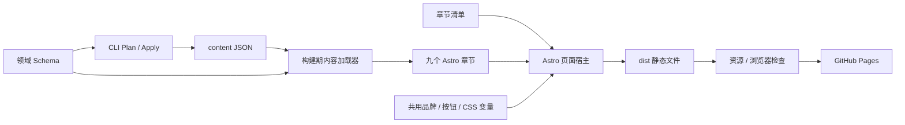

# 当前网站架构

2026-09-07 的架构迁移将页面、内容维护和发布接到同一条实际运行的构建链上。当前是一个 Astro 静态网站，包含九个本地章节模块；没有 CMS、客户端路由、运行时插件 SDK 或独立包发布机制。

## 构建与内容流向

| 边界 | 实际文件 | 维护规则 |
|---|---|---|
| 页面组合 | `apps/site/src/pages/index.astro`、`src/chapters.ts` | 清单选择真实组件、顺序和导航 |
| 内容加载 | `packages/content-loader-git/index.mjs` | 导入 JSON，构建前统一校验；参与开发热更新 |
| 内容约束 | `packages/domain/schema.mjs`、`index.mjs` | 字段、枚举、ID、引用、Evidence 与 Operation 输入共用规则 |
| 章节 | `plugins/<id>/Section.astro`、`styles.css`、可选 `client.js` | 内容展示、CSS 和交互归本章节维护 |
| 共享视觉 | `packages/design-system/` | 实际组件及唯一 `tokens.css`；没有另一份 tokens JSON |
| 浏览器基础功能 | `packages/kernel/` | 独立挂载、导航、iframe 启动队列和画质预算 |
| 发布检查 | `packages/verification/`、`tools/smoke-site.mjs` | 检查本次构建，包含真实内容变更与浏览器行为 |

## 章节边界

`home → about → research → outputs → achievements → partners → activities → paths → join`

Research 包含研究方向、研究宣言和项目列表；这些子区继续保留 `#research`、`#projects`。合作机构横条属于 Partners，在 Home 后显示。Paths 位于 Activities 和 Join 之间，保存匿名去向汇总。

每个清单声明真实入口、顺序、导航标签、读取集合和可用操作。宿主通过 Astro 的构建期导入发现章节，不维护固定的八章数组。新增模板读取的集合必须在 `consumes` 中声明，验证器会检查。`consumes` 是维护契约，不是沙箱权限系统。

章节 CSS 保留原有层级与视觉数值，限制在对应 `data-plugin`／`data-plugin-owner` 下。跨章节共用的 reset、排版、按钮、导航和变量留在设计系统。修改某个章节不必修改总样式文件。

每个交互模块独立动态导入；`mountChapter()` 只负责一次挂载与失败回退，不建立事件总线或跨章节业务状态。Research 的初始化异常不会中断项目筛选、Outputs 或 Join。静态内容在 JavaScript 不可用时仍可阅读。当前没有客户端页面切换，因此没有为未使用的卸载场景新建生命周期框架。

Astro 模板、组件 Props 和宿主使用 strict 检查；保留下来的 Canvas／WebGL 控制器仍是 JavaScript，未声称已经全部改写为 TypeScript。

## 内容操作

公开实体由 JSON 生成页面。项目、成果、活动、奖项、合作机构和去向统计不再维护平行的硬编码 HTML 名录；统计值从同一内容集合计算。机构采用永久 `org:` ID，序号只负责显示。地址与坐标放在机构记录，地图避让偏移放在 Partners 的 `map-layout.json`。没有定位资料的新增机构可以进入名录，不补造地址。

Plan、dry-run 和 Apply 共享候选内容转换；完整候选文档校验通过后才允许写入。媒体替换统一采用 `id + patch + evidenceRefs`。Operation 版本更新到 2，旧版本计划需要重新生成。输入 Schema 由领域字段派生，使用 `task schema` 查看，不再手工同步两套字段定义。

Apply 写入结构化文件及 `.aita/history/`，不会偷偷构建或发布。语义 Diff 默认读取最后修改的历史记录，返回受内容依赖影响的真实章节锚点。嵌套的研究方向 ID 也可查询。

三处招新按钮共用 `JoinLink.astro`，链接源是首条招新记录的 `formUrl`，未配置时回到 `#join`。品牌共用 `Brand.astro`。旧的首页精选操作没有展示入口，已移除，未增加不需要的精选栏目。

`content/redirects.json` 接入 Astro 原生静态重定向。GitHub Pages 的静态跳转由 HTML 完成，不能承诺宿主返回 HTTP 301／308；需要 HTTP 状态重定向时另行选择支持它的托管服务。

## 特效与产物

About、Outputs 保留原有效果并继续使用 iframe 隔离。源码、样式与本地依赖分别放在各自 `effect/` 下。About 的 Three.js 已从 base64 中解出；Outputs 的既有预打包模块拆到本地 `vendor/`，保留原始模块结构。这些文件是固定的第三方输入，不冒充已经恢复出的上游 TypeScript 工程。

`tools/prepare-effects.mjs` 生成公共特效文件，Astro 构建的 `dist/` 是唯一发布目录。`content/`、CLI、原始证据、测试副本、历史截图和开发用艺术素材不会进入网页产物。普通静态图片放在 `apps/site/public/assets/images/`；骑士图和地图的再导出工具留在 `tools/artwork/`，使用方式见 `tools/PERFORMANCE.md`。

## 验证与发布

- `npm run check`：检查实际 Astro 模板与 Props。
- `npm run verify`：14 项检查，包括领域内容、实际章节和组件、媒体与证据文件、生成 HTML、资源依赖、构建新鲜度、性能预算和 Recipe。
- Recipe：在隔离副本中执行 Plan → dry-run → Apply → 重复 Apply → Astro 构建；确认项目、活动、媒体、成果状态和三处招新链接进入网页。另验证非法更新无写入。
- `npm run smoke`：桌面和手机走过原站交互，并执行一次 Research 故障注入；不扩展为通用端到端测试平台。
- `aita preview create --json`：重新构建，实际生成当前截图和报告，保存到 `.work/preview/`。

预算按每个真实资源的 gzip 字节相加：全部主站动态脚本和内联代码约 21 KB，CSS 约 17 KB；About 整套 iframe 约 175 KB，Outputs 约 610 KB。图片不计入 JavaScript 预算，两个 iframe 也不被伪装成首屏零成本。准确数值以当前 `verify` 输出为准；字节预算不是 FPS 或 GPU 耗时测量。

工作流在 PR 与 main 上运行相同检查，通过后才上传并发布 `dist/`。GitHub Pages 的 Source 需要使用 GitHub Actions；首次迁移要在推送部署前核对这一设置，不能继续从根目录发布。部署方式依据 [Astro 的 Pages 指南](https://docs.astro.build/en/guides/deploy/github/) 和 [GitHub 自定义工作流文档](https://docs.github.com/en/pages/getting-started-with-github-pages/using-custom-workflows-with-github-pages)。

原来只读取旧发布清单的 `rollback inspect` 已移除。回退以 Git 中的完整版本为单位，经同一检查重新构建和部署；未实现的 Studio、Pagefind、SDK 等空壳不再登记为现有能力。历史规划在 `docs/archive/`；旧预览和生成清单已从当前源码路径移出，原记录仍可通过 Git 历史查看。
